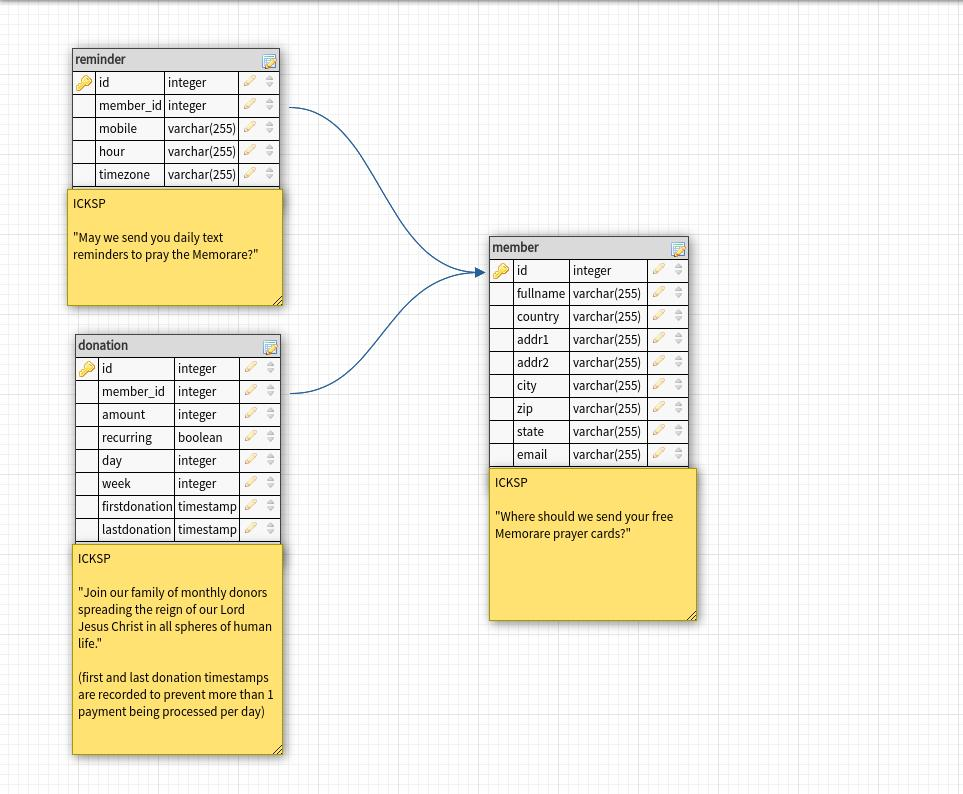

# payments

(server side)

- We store information on the api server before any payment is processed by the Client (member) and the payment system (Stripe).

- We collect/update information at each point (frame/view) in the application.

- When the Client (member) is asked for CC information, their "receipt" has already been printed. The button (Stripe element) that confirms their payment will display the amount being charged. If the amount being displayed doesn't match what the member agreed to, they will most likely not press it.

#

create sample database using PostgreSQL

    (𝝺). sudo -u postgres psql
    psql (13.0 (Ubuntu 13.0-1.pgdg20.04+1), server 12.4 (Ubuntu 12.4-1.pgdg20.04+1))
    Type "help" for help.

    postgres=# create database icksp;
    CREATE DATABASE
    postgres=# create user icksp with encrypted password 'logos';
    CREATE ROLE
    postgres=# grant all privileges on database icksp to icksp;
    GRANT
    postgres=# \q
